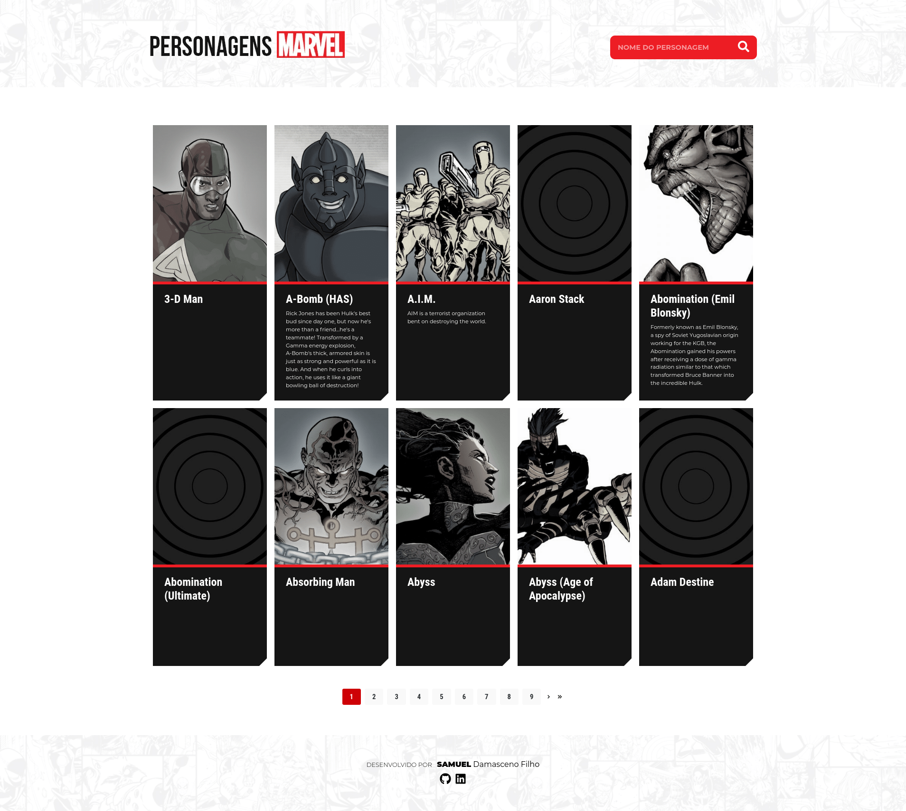
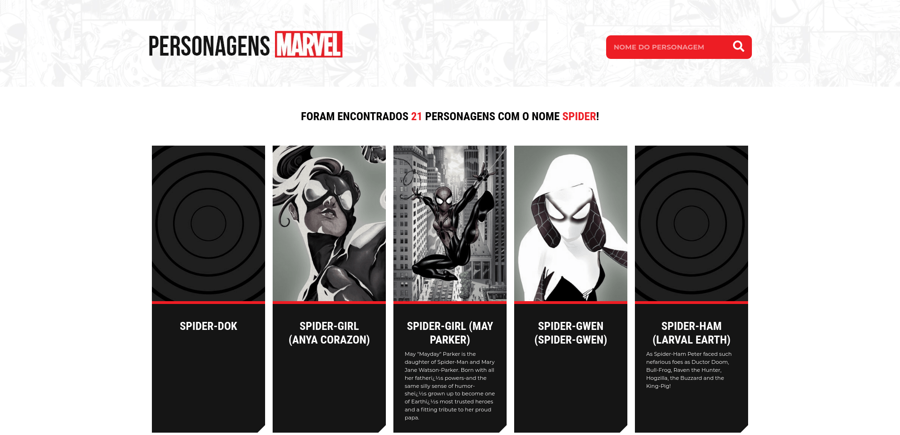
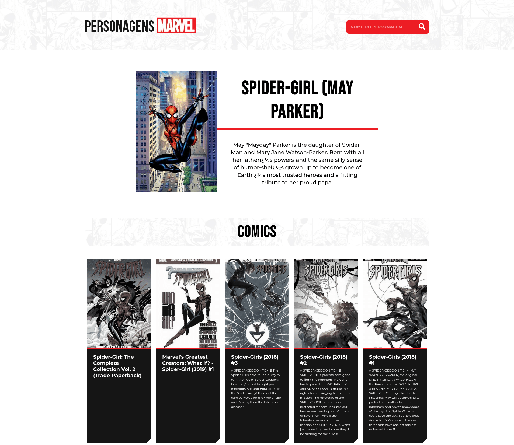
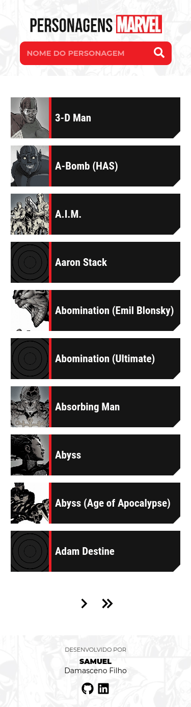
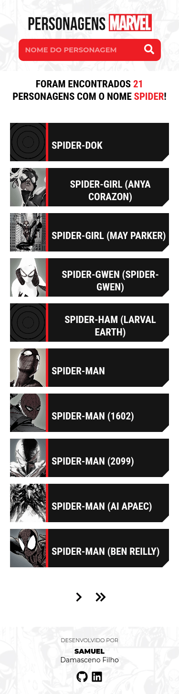
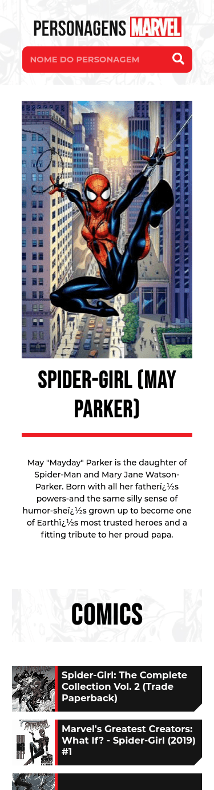

## Instalação
Clone ou faça download do repositório para o seu computador.

Abra o terminal dentro do diretório do projeto e utilize um dos seguintes comandos:

```bash
npm run dev
# ou
yarn dev
```

Abra [http://localhost:3000](http://localhost:3000) no seu navegador para ver o resultado.

## Variáveis ambiente

NEXT_PUBLIC_SITE_URL= **URL do site**

NEXT_PUBLIC_API_MARVEL_TS= **Timestamp para API da Marvel**

NEXT_PUBLIC_API_MARVEL_KEY= **API Key fornecido pela Marvel**

NEXT_PUBLIC_API_MARVEL_HASH= **Hash gerado do TS + KEY PÚBLICA + KEY PRIVADA**

NEXT_PUBLIC_LIMIT= **Limite de registros buscadados na API**

## Deploy na Vercel
https://personagens-marvel.vercel.app/

## Prints - Desktop




## Print - Mobile



